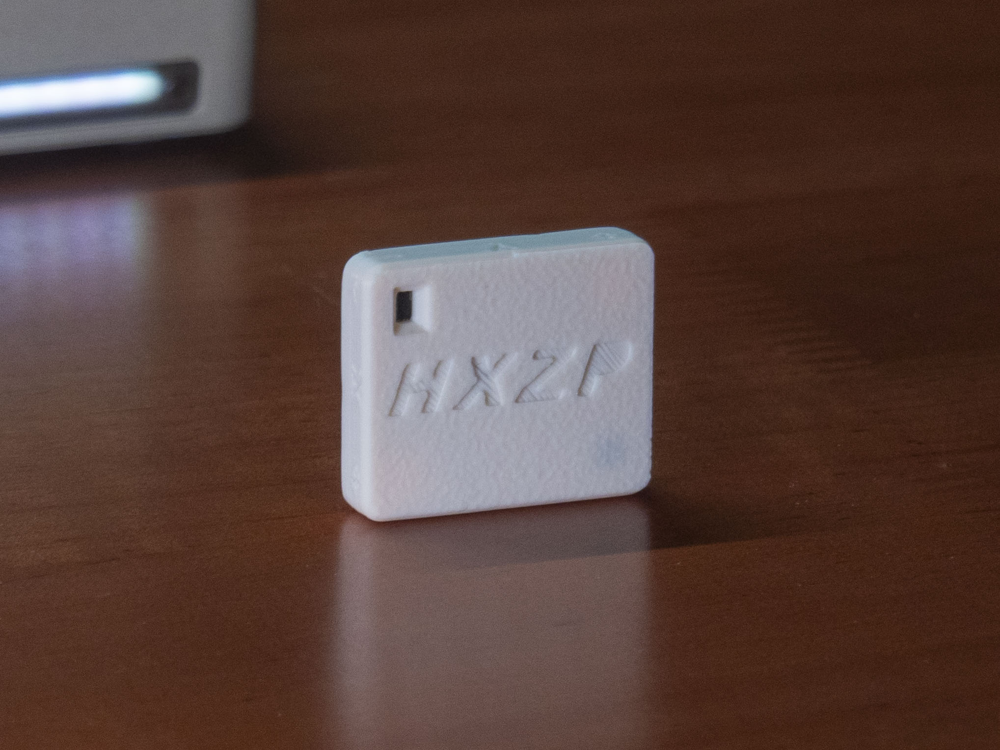
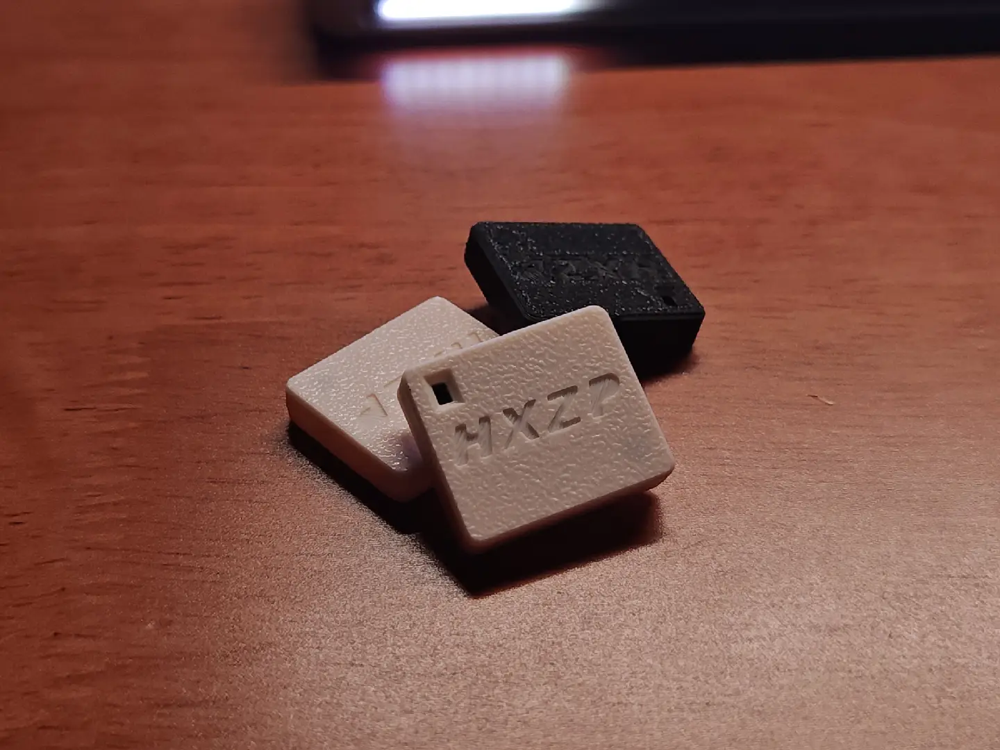
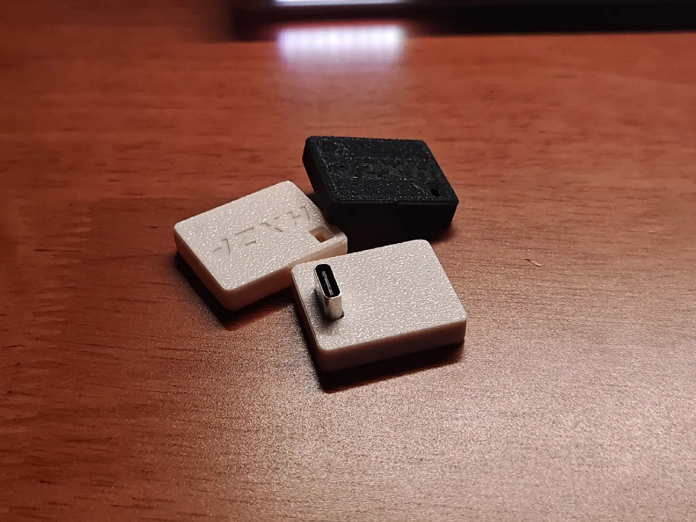
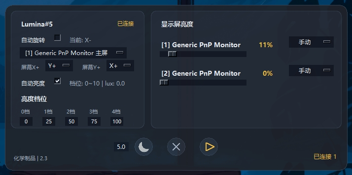
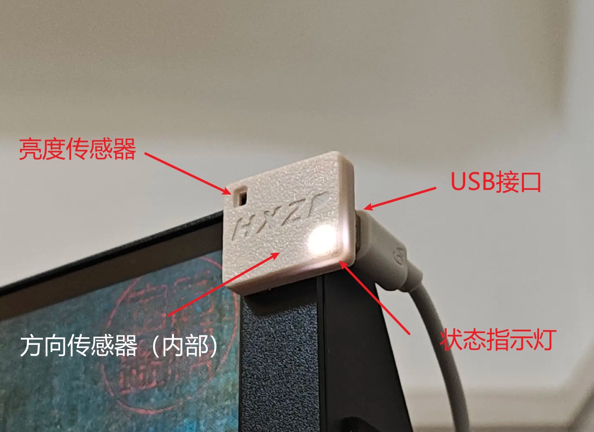

# Lumina 智能显示辅助模块产品介绍

## 1. 产品定位

Lumina 是一款面向显示器和 Windows 电脑的智能辅助模块。设备通过 USB 连接电脑，配合软件读取环境光和设备方向，帮助显示器实现自动亮度、自动旋转和自动暗屏等功能。

产品适合需要快速升级显示体验的场景，例如商业显示设备、办公显示器、教育会议设备、展厅显示设备和多屏工作站。

## 2. 核心卖点

| 卖点 | 说明 |
| --- | --- |
| 即插即用 | 通过 USB 连接电脑，配套软件可自动识别设备，减少安装和维护成本。 |
| 自动亮度 | 根据环境光变化调整显示器亮度，提升观看舒适度。 |
| 自动旋转 | 识别设备方向变化，配合软件调整绑定显示器的横竖屏方向。 |
| 自动暗屏 | 屏幕空闲时自动降低亮度，减少功耗，绿色环保。 |
| 多设备管理 | 支持多台 Lumina 分别绑定不同显示器，适合多屏环境。 |
| 状态提示清晰 | 设备状态可通过指示灯和上位机界面查看，便于确认连接情况。 |

## 3. 功能概览

  
  

### 3.1 环境光感知

Lumina 可感知周围光线变化，并根据亮度状态调节显示器亮度。该能力可用于智能设备根据白天/夜间或室内光线变化进行策略切换

### 3.2 方向识别

设备可判断当前显示器安装或摆放方向，并在方向变化时调整画面方向。

### 3.3 上位机管理

上位机可查看设备状态，并手动控制设备。

## 4. 产品结构与接口

  
  

| 模块 | 说明 |
| --- | --- |
| 环境光感知区 | 用于感知周围光线变化。 |
| 方向识别单元 | 用于识别设备当前安装或摆放方向。 |
| USB 接口 | 用于连接电脑并供电。 |
| 状态指示灯 | 用于提示连接和工作状态。 |

## 5. 规格参数

| 项目 | 当前信息 |
| --- | --- |
| 产品名称 | Lumina 智能显示辅助模块 |
| 连接方式 | USB 连接电脑 |
| 主要功能 | 自动亮度、自动旋转、自动暗屏 |
| 设备管理 | 支持多设备与多显示器绑定 |
| 供电方式 | USB-C |
| 外壳尺寸 | 26mmx22mmx6mm |
| 外壳材质 | PLA |
| 包装清单 | 模块本体、USB线（A to C） |

## 6. 价格
|  | 数量 | 价格 |
| --- | --- |--- |
| 市场价 | | ￥ 64.00 |
| 批发价 | 100 | ￥ 50.00 |
| 批发价 | 200 | ￥ 48.00 |
| 批发价 | 400 | ￥ 46.00 |
| 批发价 | 800 | ￥ 44.00 |

## 7. 相关链接
https://www.bilibili.com/video/BV1HB7U6pEVo/?spm_id_from=333.1387.homepage.video_card.click&vd_source=a9df6d0440d030fce82259d4327b2013

