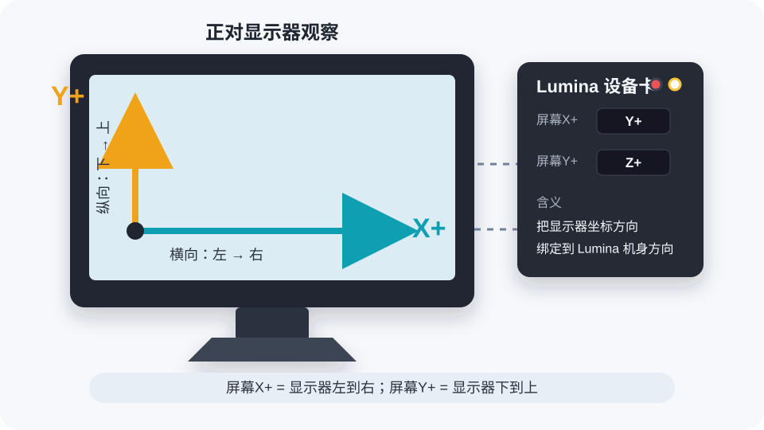

# Lumina-host

Lumina-host 是 Lumina 的 Windows 上位机程序。它通过 USB HID 读取 Lumina 设备的方向和环境光数据，并结合 Windows 显示器亮度控制能力，实现自动旋转、自动亮度、自动暗屏和设备 LED 控制。

## 功能

- 监听 Lumina 姿态方向，并自动旋转绑定的显示器。
- 读取 Lumina 环境光 lux 数据，并按五档亮度配置调节显示器。
- 支持多台 Lumina 设备，每台设备可分别绑定显示器和自动亮度目标。
- 支持手动调节多显示器亮度，优先使用 DDC/CI，必要时使用 WMI。
- 支持在托盘面板中开启或关闭每台 Lumina 的 LED，并记忆 LED 状态。
- 主机锁屏、休眠或睡眠前会临时关闭已连接 Lumina 的 LED，解锁或恢复后按配置恢复。
- 支持打包为文件夹版 `Lumina.exe`。

## 快速使用

1. 连接 Lumina 设备。
2. 运行 `Lumina.exe`，或运行源码版 `python src\auto_dim_screen.py`。
3. 在 Windows 托盘区找到 Lumina 图标，点击或右键选择“亮度调节”打开面板。
4. 在上方的 Lumina 设备卡中选择目标显示器，并按需要开启“自动旋转”和“自动亮度”。
5. 在设备卡右上角点击红色圆点关闭 LED，点击白色圆点打开 LED。每次点击都会立即下发一次指令，并保存为下次启动的默认状态。
6. 在下方显示器区域选择“手动”时，可拖动亮度滑杆；选择某台 Lumina 时，该显示器交由对应设备自动亮度控制。
7. 面板底部左侧输入框用于设置自动暗屏空闲阈值，月亮按钮用于启用或暂停自动暗屏，中间按钮关闭面板，右侧三角按钮开启或关闭自启动。

## 托盘菜单

- `亮度调节`：打开当前托盘面板。
- `启用自动调光`：启用或暂停自动暗屏/自动调光逻辑。
- `立即恢复亮度`：立刻恢复被自动暗屏压低的亮度。
- `开启自启动`：把当前发布版路径写入当前用户启动项。
- `关闭自启动`：移除当前用户启动项。
- `退出`：退出 Lumina-host。

## 面板说明

### Lumina 设备卡

每张设备卡对应一台 Lumina。卡片标题为设备名称，右上角两个圆点用于控制设备 LED：红色表示关闭，白色表示打开。圆点外框会标出当前保存的 LED 状态。

显示器坐标轴以正对屏幕观察为准：横向从左到右为 `X+`，纵向从下到上为 `Y+`。设备卡中的 `屏幕X+` 和 `屏幕Y+` 就是把这两个显示器方向分别绑定到 Lumina 当前安装后的机身方向。

Lumina 外壳边缘有坐标轴丝印，设置 `屏幕X+` 和 `屏幕Y+` 时可以直接对照丝印判断机身方向。



设备卡中的控件会自动保存，不需要额外点击保存按钮：

- `自动旋转`：控制该 Lumina 是否参与显示器旋转。
- `当前`：显示设备当前识别到的朝向。
- 显示器下拉框：选择自动旋转作用的目标显示器。
- `屏幕X+` 和 `屏幕Y+`：设置显示器横向和纵向分别对应 Lumina 机身的哪个方向。
- `自动亮度`：控制该 Lumina 是否按环境光档位调节绑定显示器。
- `亮度档位`：五个输入框分别对应 0 档到 4 档目标亮度百分比；点击档位名称可编辑 lux 分界点。

### 显示器亮度区

显示器区域列出当前可调亮度的显示器。每行右侧下拉框用于选择亮度控制来源：

- `手动`：显示亮度滑杆，可直接拖动调节亮度。
- Lumina 名称：该显示器绑定到对应 Lumina 的自动亮度；当对应设备开启自动亮度时，手动滑杆会隐藏。

右下角显示当前已连接 Lumina 数量。设备卡内不再单独显示“已连接”文字。

## 运行源码版

建议使用 Python 3.13，也支持 Python 3.12。

```powershell
python -m pip install -r requirements.txt
python src\auto_dim_screen.py
```

## 一键打包

在新电脑上只需要安装 Python 3.13 或 Python 3.12，然后双击或运行：

```bat
tools\build_release.bat
```

脚本会自动选择可用的 Python，检查并安装 `requirements.txt` 中的依赖，然后运行 PyInstaller 打包。

打包成功后的输出目录为：

```text
dist_release\Lumina
```

运行发布版时需要保留整个 `Lumina` 文件夹，不要只复制 `Lumina.exe`。

## 目录

```text
Lumina-host/
├─ assets/              图标资源
├─ src/                 上位机源码
├─ tools/               打包、自启动和发布辅助脚本
├─ requirements.txt     Python 依赖
└─ README.md            项目说明
```

## 自启动

推荐直接使用面板底部右侧三角按钮或托盘菜单中的自启动项。也可以手动运行：

```powershell
powershell -ExecutionPolicy Bypass -File tools\install_autostart.ps1
powershell -ExecutionPolicy Bypass -File tools\uninstall_autostart.ps1
```

自启动写入当前用户注册表：

```text
HKEY_CURRENT_USER\Software\Microsoft\Windows\CurrentVersion\Run
```

如果移动了 `Lumina` 文件夹位置，请重新运行程序并重新开启自启动。

## 配置和日志

设备绑定、亮度档位、自动暗屏状态和 LED 开关状态会自动写入应用配置文件，通常不需要手动编辑。

默认日志位置：

```text
dist_release\Lumina\logs\lumina.log
```

如果程序目录不可写，会自动回退到：

```text
%LOCALAPPDATA%\Lumina\logs\lumina.log
```

## 常见问题

### 找不到 Python

安装 Python 3.13 或 Python 3.12，并在安装时勾选“Add python.exe to PATH”。安装完成后重新运行 `tools\build_release.bat`。

### 依赖安装失败

确认电脑可以访问 Python 包源，然后重新运行 `tools\build_release.bat`。如果公司网络或安全软件拦截了 pip，需要先放行 Python 和 pip。

### Access is denied

打包时如果提示 `Access is denied`，通常是以下原因：

- `Lumina.exe` 正在运行。
- 资源管理器打开了 `dist_release\Lumina` 或 `build` 目录。
- 上一次使用管理员权限打包，导致普通权限无法删除旧文件。

处理方式：

1. 退出正在运行的 Lumina。
2. 关闭打开在 `dist_release` 或 `build` 下的资源管理器窗口。
3. 重新运行 `tools\build_release.bat`。
4. 如果仍失败，使用管理员权限运行 `tools\build_release.bat`。

### 外接显示器无法调亮度

请确认显示器支持并开启 DDC/CI。部分显示器、扩展坞或转接线可能不支持亮度控制。

### LED 点击后没有反应

确认 Lumina 固件已经包含 LED HID 控制功能，并检查日志中是否有 HID Feature Report 下发失败记录。
